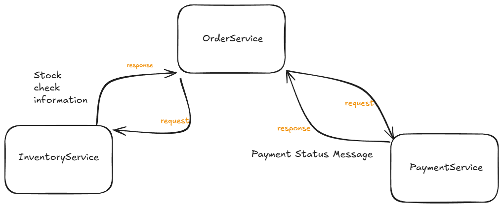
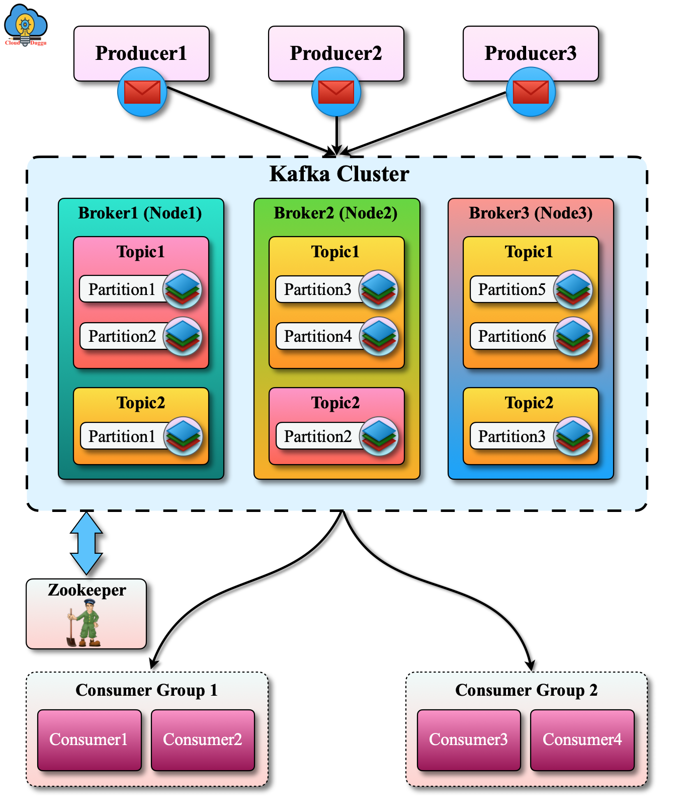

## Apache Kafka

- ilk olarak makinede kafkayı çalıştırmalıyız. Benim tercihim docker ile basit şekilde kafkayı ayağa kaldırmak.
Tanımladığım ```docker-compose.yml``` dosyasında gerekli kafka, zookeeper, kafka-ui konfigurasyonları mevcut. 
Bu dosyayı 
```bash
docker-compose up -d
```
komutu ile çalıştırıyoruz ve kafka konteynırlarımızla birlikte kafka da aktif hale geliyor.

- KafkaTemplate instance'ı sayesinde ilgili topic'lere mesaj atıyoruz. [kod](OrderService/src/main/java/com/example/OrderService/OrderController.java)
- @KafkaListener anotasyonu ile de ilgili methoda mesajı parametre olarak alıp işliyoruz. [kod](OrderService/src/main/java/com/example/OrderService/OrderListener.java)

### Proje Diagram


#### Log
orderservice\
---------------------------------------\


inventoryservice\
---------------------------------------\


paymentservice\
---------------------------------------\


#### General Kafka Diagram

