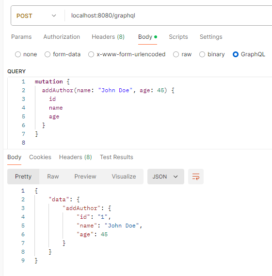
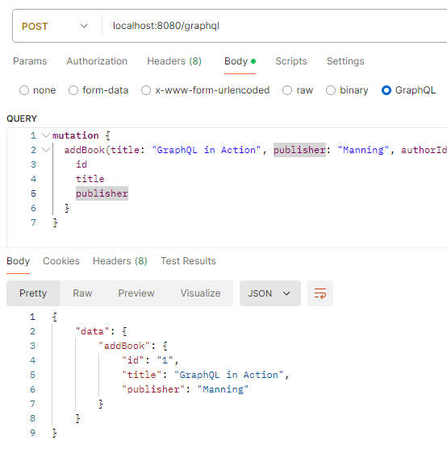
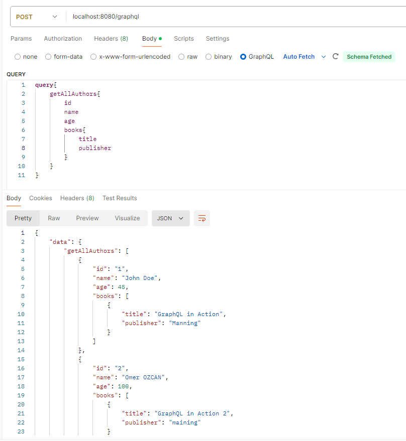

## GraphQL
GraphQL, istek içerisinde nesnelerin özelliklerini belirtme fırsatı vererek sadece ihtiyaç duyulan verilerin alınmasını sağlıyor. 
Aynı şekilde bir istek sonucu (create, update, ...) dönen verilerinde ayrıntılarını tanımlama şansı veriyor.
Tek bir endpoint'e ```localhost:8080/graphql``` istek detaylarını body içerisinde JSON formatında tanımlayarak iletişim kurmamızı sağlıyor.

#### Uygulanması
- Bağımlılıkların pom.xml dosyasına eklenmesi.
- ```src/main/resources/graphql``` dizininde schema.graphqls dosyası oluşturarak, burada request ile kullanılacak veri 
modelleri ve istek sonucu çalıştırılacak methodlar tanımlanır. Basit ve kendine özgü bir syntax'ı var.
- Burada kullanılan class, variable ve method isimleri tamamen kod ile aynı olmalı aksi taktirde uygulama ayağa 
kalkarken loglara unmapped olarak düşer ve o işlevi kullanamaz olur.
- Resolver/Controller yapısında aynı method isimleri kullanılarak bu methodları @QueryMapping/@MutationMapping ya da 
@SchemaMapping(...) ile bağlanmalarını saplamalıyız.


#### Request Examples


