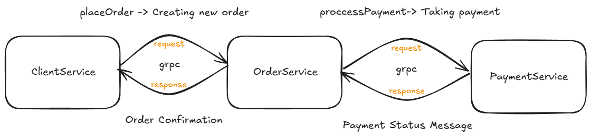

## gRPC
- pom.xml dosyasına gRPC bağımlılıklarını ve derlemek için plugin'i ekle.
- Veri alış verişinde kullanılacak veri yapılarını (modelleri) ve service'ler arasında request atarken 
kullanılacak methodları soyut olarak .proto dosyasında tanımla. Bir nevi veri alışveriş protokolü oluşturuyoruz ve burada 
tanımlanan veri yapıları harici veri gönderimini kısıtlıyoruz. Veri akışının kontrolünü direkt bu dosyada tanımlamış olduk.
- ``` mvn clean install ``` ile derlediğimizde gRPC java sınıflarımızı oluşturacak ve oluşan bu kütüphaneyi .jar olarak kaydedeceğiz.

- Microservice'lere gRPC ve oluşturduğumuz "Common" kütüphanerlini ekliyoruz.
- Service'lerin içerisine Common kütüphanesinde tanımlı sınıfları extends edip, soyut methodları burada override ederek 
iletişim servislerini içerlerine tanımlıyoruz.
- Son olarak ClientService'den bir order talebi oluşturarak. İletişimi başlatıyoruz.

### Senaryo
    1-ClientService, order oluşturur ve OrderService'e request atar. 
    2-OrderRequest, ödeme almak için PaymentService'e request atar. 
    3-PaymentServis, OrderService'e olumlu durum döner. 
    4-OrderService de ClientService'e olumlu sonucu bildirir.

### ClientService - Log

### OrderService - Log

### PaymentService - Log
